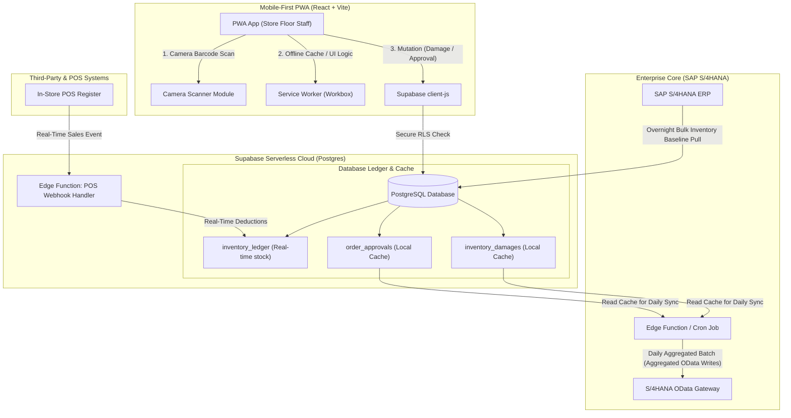

# ARCHITECTURE.md — SAP LiveRetail: Real-Time Stock Replenishment Engine

This document outlines the architectural blueprint, design constraints, and technical specifications for **SAP LiveRetail: Real-Time Stock Replenishment Engine**. This platform enables modern retail stores to perform real-time inventory tracking, mobile-first inventory adjustments, and automated stock replenishment while maintaining strict compliance and cost limits with existing SAP ERP architectures.

---

## 1. Executive Summary & Product Vision

Legacy retail environments often operate under a critical visibility lag: in-store sales happen in real time, but core ERP systems (such as SAP S/4HANA) process inventory updates in overnight batch runs. This "blind spot" leads to out-of-stock situations, inaccurate replenishment orders, and lost revenue.

**SAP LiveRetail** bridges this gap by introducing a real-time, lightweight serverless ledger between the physical stores and the SAP core. By combining real-time Point of Sale (POS) event streams with a mobile-first Progressive Web Application (PWA), floor staff can immediately inspect, adjust, and scan stock, while the system manages the complexity of SAP OData API limits, offline sync, and licensing costs.

---

## 2. Technical Stack

| Tier | Technology | Description / Justification |
| :--- | :--- | :--- |
| **Frontend** | React (v18+) + Vite | Ultra-fast build times, modern Component lifecycle, and a highly responsive SPA foundation. |
| **Mobile Capability** | Progressive Web App (PWA) | Service workers for offline caching, installability on mobile devices, and access to native hardware APIs (Camera). |
| **Backend / DB** | Supabase (PostgreSQL) | Fully-managed serverless Postgres. Real-time subscriptions, Edge Functions for webhook ingestion, and secure Row-Level Security (RLS). |
| **APIs / Integration** | REST Webhooks & SAP OData | Supabase Edge Functions digest incoming POS webhook events; outgoing SAP integrations execute via standard OData Batch calls. |

---

## 3. System Topology & Data Flow

The diagram below illustrates how real-time POS sales data and floor staff adjustments are buffered locally in Supabase to maintain a real-time stock position, which is then batched daily to update the SAP S/4HANA ERP system.



---

## 4. Core Design Constraints

### Constraint 1: Bypassing the Overnight SAP Batch Blind Spot
Traditional SAP deployments pull sales figures and run inventory calculation tasks in overnight batches. Between batch runs, the system is "blind" to in-store sales, leading to duplicate replenishment orders or premature stockouts.

*   **Solution**: SAP LiveRetail bypasses this blind spot by exposing a public HTTP endpoint via **Supabase Edge Functions** to receive real-time POS transaction webhooks as they occur at registers.
*   **Process**: Every time a sale is completed, the POS system fires a webhook containing the itemized sales. The Edge Function parses this payload and immediately updates the local ledger in Supabase, keeping stock counts current to the second.

### Constraint 2: The Local Inventory Ledger
To enable instant local decision-making, we maintain a dual-source-of-truth inventory engine within PostgreSQL, structured around three primary quantities:

$$\text{current\_calculated\_stock} = \text{sap\_baseline\_qty} - \text{pos\_live\_deductions}$$

*   **`sap_baseline_qty`**: The inventory quantity synced from SAP S/4HANA during the most recent overnight synchronization.
*   **`pos_live_deductions`**: The running total of quantities sold through the POS systems *since* the last overnight SAP sync. This value is reset to `0` once a new baseline is loaded from SAP.
*   **`current_calculated_stock`**: The actual real-time inventory count displayed to floor staff. This is dynamically computed inside the database.

### Constraint 3: Near-Zero SAP Licensing Cost Strategy (Digital Access Mitigation)
SAP charges organizations for direct API interactions, particularly when external applications create or modify business objects directly in real time (SAP Digital Access licensing model). Real-time writes from every mobile device or POS event could trigger unsustainable transaction fees.

*   **Solution**: **Local Caching & Aggregation**.
    *   **In-store damages** (discarded, broken, or expired stock) and **replenishment order approvals** are written exclusively to local tables in Supabase (`inventory_damages` and `order_approvals`).
    *   They remain cached in Supabase with a status of `PENDING_SYNC`.
    *   Once per day (typically during low-traffic night hours), a scheduled background job aggregates these records by Store and Product SKU.
    *   The accumulated adjustments are packed into a single OData bulk batch document (`$batch` multipart request) and posted to the S/4HANA OData API.
    *   By consolidating thousands of micro-transactions into a single daily transaction document per store, the Digital Access footprint is reduced by over 99%.

### Constraint 4: Mobile-First PWA & Camera Barcode Scanning
Store floor staff need to verify or adjust stock directly at the shelf without carrying expensive, dedicated RF scanning terminals.

*   **Solution**: A Progressive Web App optimized for mobile viewports.
    *   **PWA Shell**: Cached locally via a Service Worker (using Workbox) to ensure responsiveness even in store basement areas with weak Wi-Fi or cellular connectivity.
    *   **Camera Scan**: Integrated barcode scanning using web standards (HTML5 Canvas + WebRTC stream) via lightweight libraries (e.g., `html5-qrcode` or `jsQR`).
    *   **Offline Mode**: Scans and manual inventory adjustments are queued in local IndexedDB if the network drops, and are automatically synced back to Supabase once the connection is restored.

---

## 5. Database Schema & Data Models

Below is the SQL schema designed for the Supabase PostgreSQL database to support these constraints, including the automatic stock calculation trigger.

```sql
-- Enable UUID extension
CREATE EXTENSION IF NOT EXISTS "uuid-ossp";

-- 1. STORES TABLE
CREATE TABLE stores (
    id UUID PRIMARY KEY DEFAULT uuid_generate_v4(),
    name VARCHAR(255) NOT NULL,
    sap_plant_code VARCHAR(10) UNIQUE NOT NULL, -- Corresponds to SAP Werks code
    created_at TIMESTAMP WITH TIME ZONE DEFAULT TIMEZONE('utc', NOW()) NOT NULL
);

-- 2. PRODUCTS TABLE
CREATE TABLE products (
    id UUID PRIMARY KEY DEFAULT uuid_generate_v4(),
    sku VARCHAR(50) UNIQUE NOT NULL,            -- SAP Material Number (MATNR)
    barcode VARCHAR(100) UNIQUE,                -- GTIN/EAN code for scanning
    name VARCHAR(255) NOT NULL,
    description TEXT,
    uom VARCHAR(10) DEFAULT 'PC' NOT NULL,      -- Unit of Measure (e.g., Piece, Box)
    created_at TIMESTAMP WITH TIME ZONE DEFAULT TIMEZONE('utc', NOW()) NOT NULL
);

-- 3. INVENTORY LEDGER (Real-Time Ledger)
CREATE TABLE inventory_ledger (
    store_id UUID REFERENCES stores(id) ON DELETE CASCADE,
    product_id UUID REFERENCES products(id) ON DELETE CASCADE,
    sap_baseline_qty INTEGER DEFAULT 0 NOT NULL,
    pos_live_deductions INTEGER DEFAULT 0 NOT NULL CHECK (pos_live_deductions >= 0),
    current_calculated_stock INTEGER DEFAULT 0 NOT NULL,
    last_sap_sync_at TIMESTAMP WITH TIME ZONE DEFAULT TIMEZONE('utc', NOW()) NOT NULL,
    updated_at TIMESTAMP WITH TIME ZONE DEFAULT TIMEZONE('utc', NOW()) NOT NULL,
    PRIMARY KEY (store_id, product_id)
);

-- Trigger to dynamically compute current stock before insert or update
CREATE OR REPLACE FUNCTION calculate_current_stock()
RETURNS TRIGGER AS $$
BEGIN
    NEW.current_calculated_stock := NEW.sap_baseline_qty - NEW.pos_live_deductions;
    NEW.updated_at := TIMEZONE('utc', NOW());
    RETURN NEW;
END;
$$ LANGUAGE plpgsql;

CREATE TRIGGER trg_calculate_current_stock
BEFORE INSERT OR UPDATE ON inventory_ledger
FOR EACH ROW
EXECUTE FUNCTION calculate_current_stock();

-- 4. INVENTORY DAMAGES (Local SAP Licensing Cache)
CREATE TYPE damage_status AS ENUM ('PENDING_SYNC', 'SYNCED', 'FAILED');

CREATE TABLE inventory_damages (
    id UUID PRIMARY KEY DEFAULT uuid_generate_v4(),
    store_id UUID REFERENCES stores(id) ON DELETE CASCADE NOT NULL,
    product_id UUID REFERENCES products(id) ON DELETE CASCADE NOT NULL,
    reported_by UUID NOT NULL, -- Reference to auth.users
    quantity INTEGER NOT NULL CHECK (quantity > 0),
    damage_reason TEXT NOT NULL,
    status damage_status DEFAULT 'PENDING_SYNC' NOT NULL,
    sap_batch_id VARCHAR(100), -- Holds reference to SAP batch once synced
    created_at TIMESTAMP WITH TIME ZONE DEFAULT TIMEZONE('utc', NOW()) NOT NULL,
    synced_at TIMESTAMP WITH TIME ZONE
);

-- 5. ORDER APPROVALS (Local SAP Licensing Cache)
CREATE TYPE approval_status AS ENUM ('PENDING_SYNC', 'SYNCED', 'FAILED');

CREATE TABLE order_approvals (
    id UUID PRIMARY KEY DEFAULT uuid_generate_v4(),
    store_id UUID REFERENCES stores(id) ON DELETE CASCADE NOT NULL,
    product_id UUID REFERENCES products(id) ON DELETE CASCADE NOT NULL,
    approved_by UUID NOT NULL, -- Reference to auth.users
    quantity_requested INTEGER NOT NULL CHECK (quantity_requested > 0),
    status approval_status DEFAULT 'PENDING_SYNC' NOT NULL,
    sap_batch_id VARCHAR(100), -- Holds reference to SAP batch once synced
    created_at TIMESTAMP WITH TIME ZONE DEFAULT TIMEZONE('utc', NOW()) NOT NULL,
    synced_at TIMESTAMP WITH TIME ZONE
);
```

---

## 6. Integration Architecture

### POS Ingestion Flow
1. POS system generates a JSON webhook when checkout is completed.
2. Webhook reaches `/functions/v1/pos-webhook` secure route.
3. Edge Function performs a fast upsert query in PostgreSQL:
   ```sql
   -- Increment pos_live_deductions for the corresponding store/product
   INSERT INTO inventory_ledger (store_id, product_id, pos_live_deductions)
   VALUES ($1, $2, $3)
   ON CONFLICT (store_id, product_id)
   DO UPDATE SET pos_live_deductions = inventory_ledger.pos_live_deductions + EXCLUDED.pos_live_deductions;
   ```
4. Trigger fires and computes the new `current_calculated_stock` value immediately.

### Daily SAP S/4HANA Write-Back (OData Batch)
To prevent licensing overages, write operations are aggregated at midnight. The scheduled batch engine:
1. Gathers all records in `inventory_damages` and `order_approvals` where `status = 'PENDING_SYNC'`.
2. Groups items by `store_id` (SAP Plant) and `product_id` (SAP Material Number).
3. Constructs an OData `$batch` payload. A batch request is a single HTTP POST request containing multiple operations inside a multipart body:
   ```http
   POST /sap/opu/odata/sap/API_MATERIAL_STOCK_SRV/$batch HTTP/1.1
   Content-Type: multipart/mixed; boundary=batch_sap_live_retail_12345
   Authorization: Basic [Credentials]

   --batch_sap_live_retail_12345
   Content-Type: multipart/mixed; boundary=changeset_1

   --changeset_1
   Content-Type: application/http
   Content-Transfer-Encoding: binary

   POST MaterialDocuments HTTP/1.1
   Content-Type: application/json

   {
     "GoodsMovementType": "551",
     "Plant": "1001",
     "Material": "PRODUCT_SKU_A",
     "EntryQuantity": "12",
     "EntryUnit": "PC"
   }
   --changeset_1--
   --batch_sap_live_retail_12345--
   ```
4. If SAP returns a successful `202 Accepted` status and response block, the local status is updated to `SYNCED` and the `sap_batch_id` is saved for audit trailing.

---

## 7. Security, Offline Resilience & Governance

### Security & Row-Level Security (RLS)
Supabase provides built-in API routing protected by JWT. To ensure stores cannot access or write data for other locations:
- RLS rules are applied to the `inventory_ledger`, `inventory_damages`, and `order_approvals` tables.
- Users are assigned a metadata claim containing their associated `store_id`.
- The RLS policy guarantees that users can only select and insert data where `store_id = auth.jwt() -> 'user_metadata' ->> 'store_id'`.

### Offline Resilience Strategy
- **Service Worker Caching**: The core React app assets, barcodes modules, and CSS styling are cached in CacheStorage using a `StaleWhileRevalidate` strategy.
- **IndexedDB Queue**: When the app detects that the client is offline (`navigator.onLine === false`), barcode adjustment submissions are captured, serialized, and placed into a queue inside IndexedDB.
- **Sync Listener**: When connectivity is recovered, a background sync routine flushes the queued mutations in order, maintaining audit compliance and ledger updates.
