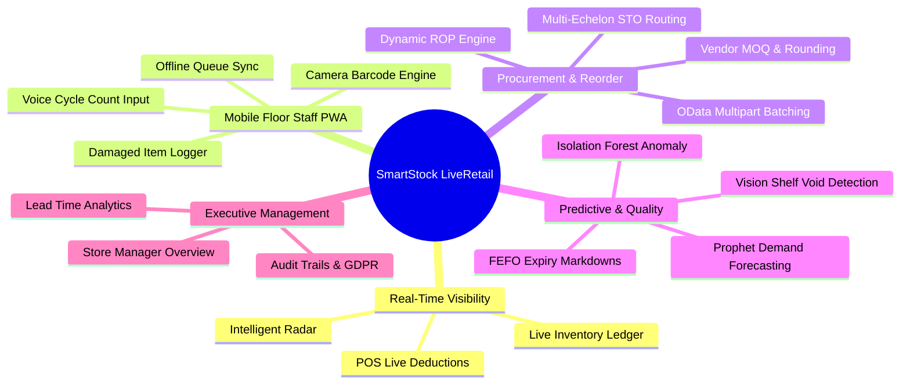

# SmartStock LiveRetail — System Architecture, Implementation Review & Roadmap Specification

**Document Version:** 1.0  
**Project:** SmartStock LiveRetail (Real-Time Stock Replenishment Engine for SAP S/4HANA)  
**Target Environment:** Next.js 15 (React 19) • Supabase (PostgreSQL + Deno Edge Functions) • Python ML Microservices • SAP S/4HANA OData V2  

---

## 1. Executive Summary & Core Value Proposition

Modern brick-and-mortar retail operations face a fundamental architectural bottleneck: **the enterprise ERP visibility lag**. Traditional Enterprise Resource Planning systems (such as SAP S/4HANA) process store transactions, master data updates, and inventory balancing in scheduled overnight batch runs. 

Between these batch cycles, the enterprise core remains blind to real-time physical store events (point-of-sale checkouts, shelf damages, shrinkage, and intra-day stockout spikes). This latency results in:
1. **Intra-Day Stockouts & Lost Sales**: Critical SKUs run out mid-day without triggering automated reorders until the next business cycle.
2. **Exorbitant SAP Digital Access Costs**: Directly writing every mobile scan, scrap movement, or individual purchase requisition directly into SAP S/4HANA in real-time triggers severe API licensing and transactional overhead.
3. **Floor Staff Disconnect**: Retail floor staff are often reliant on heavy, expensive RF handheld terminals or manual paper logs to audit stock, track expiration dates, and report damaged goods.

**SmartStock LiveRetail** resolves these constraints by providing a **lightweight, real-time, serverless operational buffer and predictive replenishment platform** between physical stores and the SAP S/4HANA enterprise core.

```
┌─────────────────────────────────────────────────────────────────────────────┐
│                           PHYSICAL RETAIL STORE                             │
│  ┌──────────────────────┐  ┌───────────────────────┐  ┌──────────────────┐  │
│  │ Point-of-Sale (POS)  │  │ Mobile PWA Staff      │  │ Shelf Vision     │  │
│  │ Real-Time Webhooks   │  │ Camera Scan / Voice   │  │ Void Detection   │  │
│  └──────────┬───────────┘  └───────────┬───────────┘  └────────┬─────────┘  │
└─────────────┼──────────────────────────┼───────────────────────┼────────────┘
              │                          │                       │             
              ▼                          ▼                       ▼             
┌─────────────────────────────────────────────────────────────────────────────┐
│                    SMARTSTOCK SERVERLESS BUFFER (SUPABASE)                  │
│  ┌───────────────────────────────────────────────────────────────────────┐  │
│  │ DUAL-SOURCE REAL-TIME LEDGER                                          │  │
│  │ current_stock = sap_baseline_qty - pos_live_deductions                │  │
│  └───────────────────────────────────┬───────────────────────────────────┘  │
│  ┌───────────────────────────┐       │       ┌───────────────────────────┐  │
│  │ Buffered Scraps (Mvt 551) │       │       │ Staged Purchase Orders    │  │
│  │ (Pending Midnight Sync)   │       │       │ (Vendor & STO Routing)    │  │
│  └─────────────┬─────────────┘       │       └─────────────┬─────────────┘  │
│                │                     ▼                     │                │
│                │          ┌───────────────────────┐        │                │
│                │          │ ML Predictive Brain   │        │                │
│                │          │ Prophet & Anomaly Svc │        │                │
│                │          └───────────────────────┘        │                │
└────────────────┼───────────────────────────────────────────┼────────────────┘
                 │                                           │                 
                 │  Consolidated Midnight OData $batch POST  │                 
                 ▼                                           ▼                 
┌─────────────────────────────────────────────────────────────────────────────┐
│                        ENTERPRISE CORE (SAP S/4HANA)                        │
│  ┌───────────────────────────────────────────────────────────────────────┐  │
│  │ API_MATERIAL_STOCK_SRV • API_MATERIAL_DOCUMENT_SRV • API_PURCHASEORDER│  │
│  └───────────────────────────────────────────────────────────────────────┘  │
└─────────────────────────────────────────────────────────────────────────────┘
```

---

## 2. Core Architectural Decisions & Engineering Highlights

### Architectural Decision 1: Dual-Source-of-Truth Real-Time Ledger
To achieve zero-latency stock tracking without continuous SAP polling:
- **Baseline Quantity (`sap_baseline_qty`)**: Extracted once nightly (02:00) from SAP S/4HANA via `API_MATERIAL_STOCK_SRV` (`A_MatlStkInAcctMod`).
- **Live Deductions (`pos_live_deductions`)**: Real-time sales transactions ingested via Supabase Edge Function `pos-webhook`, which atomically increments live deductions.
- **Computed Formula**:
  $$\text{current\_calculated\_stock} = \text{sap\_baseline\_qty} - \text{pos\_live\_deductions}$$
- A PostgreSQL database trigger automatically computes `current_calculated_stock` on any mutation, immediately propagating updates to all subscribed desktop and mobile clients over WebSockets.

### Architectural Decision 2: SAP Digital Access Licensing Cost Mitigation (>99% Fee Reduction)
Direct API calls to create business documents in SAP are metered under SAP Digital Access licensing rules. Creating individual material documents for every damaged item or itemized requisition across hundreds of stores is cost-prohibitive.
- **Local State Caching**: All in-store scrap declarations (Movement Type 551) and staged requisitions are buffered locally in PostgreSQL (`buffered_scraps`, `erp_staged_requisitions`) with status `PENDING_SYNC`.
- **Atomic End-of-Day Multipart `$batch` Posting**:
  The `sap-batch-sync` / `erp-batch-execute` Edge Functions aggregate adjustments by Plant (`WERKS`) and Material Number (`MATNR`), constructing a single multipart HTTP POST `$batch` payload.
- This condenses thousands of store-level events into **one single transaction document per store per day**.

### Architectural Decision 3: Multi-Tier Adapter Abstraction Layer
The backend is completely decoupled from any single ERP or POS vendor through abstraction factories:
- **ERP Adapter Interface** (`_shared/erp-adapter/`):
  - Standardizes methods: `fetchStockBaselines()`, `submitMaterialDocument()`, `createPurchaseOrder()`, `extractInfoRecords()`.
  - Implementations exist for **SAP S/4HANA OData V2** and a **Mock Adapter** for automated test suites and offline staging.
- **POS Adapter Interface** (`_shared/pos-adapter/`):
  - Normalizes divergent payloads from cloud and on-prem POS systems into unified transaction baskets.
  - Enforces idempotent signature checks and logs rejected transactions into a Dead Letter Queue (`pos_rejected_transactions`).

### Architectural Decision 4: Mobile-First Offline-Resilient PWA
Floor staff operate in RF-shielded basements and walk-in coolers where cellular/Wi-Fi coverage is unstable:
- **Service Worker (`src/service-worker.ts`)**: Implements `StaleWhileRevalidate` caching for application shell, static assets, and core JS/CSS bundles.
- **IndexedDB Client Queue (`idb-keyval`)**: When `navigator.onLine === false`, barcode scans, damage entries, and cycle counts are serialized into local IndexedDB storage.
- **Replay Sync (`pwa-offline-sync`)**: When the device regains network connectivity, the queue is automatically dequeued and flushed to Supabase in FIFO sequence.

### Architectural Decision 5: Multi-Echelon Sourcing & Stock Transfer Orders (STO)
Before dispatching a purchase order to an external vendor (with associated lead times and vendor minimum order quantities), the replenishment engine analyzes the regional multi-echelon network:
- Checks if a nearby Distribution Centre (DC) or sister store in the same supply cluster has surplus inventory.
- If viable, automatically stages a **Stock Transfer Order (STO Type UB)** rather than an external **Vendor Purchase Order (Type NB)**.

---

## 3. Objective Breakdown & Functional Module View



### Module 1: Intelligent Radar (`/dashboard`)
- **Purpose**: Real-time operational command center highlighting imminent stockouts and critical replenishment needs.
- **Features**:
  - Filter by merchandise categories (`FMCG`, `HIGH_VALUE`, `SEASONAL`, `HARDLINES`).
  - View calculated daily run-out horizons (Days-of-Supply remaining).
  - One-click emergency purchase order staging with vendor MOQ auto-scaling.
  - Live WebSocket updates reflecting real-time sales deductions.

### Module 2: Real-Time Inventory Ledger (`/ledger`)
- **Purpose**: Dual-source audit record displaying ERP baseline quantities side-by-side with intraday POS sales.
- **Features**:
  - Live search by SKU, Barcode (EAN/GTIN), and Product Name.
  - Detailed breakdown: `SAP Baseline Qty`, `POS Live Deductions`, `Transit Pipeline (Open POs)`, and `Net Available Stock`.
  - Visual status indicators (`HEALTHY`, `REORDER_NEEDED`, `CRITICAL_DEFICIT`).

### Module 3: Smart Cycle Counts & Voice Auditing (`/counts`, `/floor/count`)
- **Purpose**: Continuous, intelligent physical inventory verification replacing error-prone annual full-store shutdowns.
- **Features**:
  - Prioritizes items with high velocity, recent negative adjustments, or suspected ghost inventory.
  - **Voice Count Input**: Web Speech API integration allowing floor staff to speak count values hands-free (e.g., *"SKU 401 count 24"*).
  - Automatically flags discrepancy variances for manager approval before writing adjustments.

### Module 4: FEFO Expiry Actions & Waste Mitigation (`/fefo`)
- **Purpose**: First-Expired-First-Out dynamic markdown and donation routing to eliminate perishable goods write-offs.
- **Features**:
  - Tracks specific product batch expiration dates.
  - Dynamically recommends progressive discount tiers (25% markdown at 5 days to expiry, 50% at 2 days).
  - Automated routing for local food-bank donation or scrap write-off (Movement Type 551).

### Module 5: Vision Shelf Health & Void Detection (`/shelf-health`)
- **Purpose**: Camera-assisted shelf audit identifying missing facings and empty shelf slots.
- **Features**:
  - Direct camera video stream integration in the browser.
  - Highlighting bounding boxes over detected shelf voids.
  - Immediate trigger to restock shelf from backroom inventory.

### Module 6: Procurement Hub & Staged Batch Manager (`/procurement`, `/manager/procurement`)
- **Purpose**: Aggregates all store reorder proposals into consolidated vendor batches and internal STOs.
- **Features**:
  - Groups line items by Vendor ID and Plant Code.
  - Applies SAP rounding value multiples (`BSTRF`) and Minimum Order Quantities (`MINBM`).
  - Transmits approved purchase requisitions into SAP S/4HANA via OData `$batch` requests.

### Module 7: Floor Staff Mobile PWA (`/floor`, `/floor/scan`, `/floor/damage`)
- **Purpose**: Lightweight, responsive mobile interface designed for smartphone cameras and single-handed floor operations.
- **Features**:
  - Embedded HTML5 camera barcode scanner (`html5-qrcode`) with rapid scan-and-inspect workflows.
  - Quick-action scrap logger with reason codes (Damaged, Expired, Stolen).
  - Real-time offline connection banner and automatic sync indicator.

### Module 8: Executive Analytics & Loss Prevention (`/manager/analytics`)
- **Purpose**: Strategic metrics and financial impact analytics for store managers and supply chain directors.
- **Features**:
  - Protected revenue yield metrics (€ value of prevented stockouts).
  - OData API batch efficiency and digital access cost savings score (>99%).
  - Scan-to-fulfill velocity tracking and supplier lead-time deviation monitoring.

### Module 9: Machine Learning Microservices (`ml-services/`)
- **Forecast Service (`ml-services/forecast-service/main.py`)**:
  - Probabilistic demand forecasting using Prophet time-series models with 95% confidence intervals.
  - Automatically incorporates weather multipliers, holiday calendars, and promotion uplifts.
- **Anomaly Detection Service (`ml-services/anomaly-service/main.py`)**:
  - Unsupervised machine learning (Isolation Forest) analyzing scrap spikes, returns anomalies, and ghost inventory patterns.

---

## 4. Complete Codebase Inventory & Component Design

### Directory Structure Overview
```
SmartStock--Retail/
├── ARCHITECTURE.md                          # Original architecture blueprint
├── SAP_Data_Requirements_Specification.html # Complete SAP OData field specification
├── SAP_Inbound_Data_Examples.html           # Sample payloads for SAP integration
├── package.json                             # Dependencies (Next.js 15, React 19, Lucide, html5-qrcode)
├── ml-services/                             # Python ML microservices
│   ├── forecast-service/                    # Prophet probabilistic demand forecasting
│   │   └── main.py
│   └── anomaly-service/                     # Isolation Forest ghost inventory & shrink detection
│       └── main.py
├── src/
│   ├── app/
│   │   ├── (desktop)/                       # Desktop layout and module views
│   │   │   ├── counts/page.tsx              # Smart Cycle Counts
│   │   │   ├── dashboard/page.tsx           # Intelligent Radar
│   │   │   ├── fefo/page.tsx                # FEFO Expiry Actions
│   │   │   ├── ledger/page.tsx              # Inventory Ledger
│   │   │   ├── procurement/page.tsx         # Procurement Hub
│   │   │   ├── shelf-health/page.tsx        # Vision Shelf Health
│   │   │   └── layout.tsx                   # Desktop navigation sidebar & header
│   │   ├── (dashboard)/                     # Floor PWA & Manager mobile-responsive routes
│   │   │   ├── floor/                       # Floor Staff PWA (scan, count, damage)
│   │   │   └── manager/                     # Store Manager & Executive Analytics
│   │   ├── login/page.tsx                   # Role-based tenant & store authentication
│   │   └── layout.tsx & globals.css         # Root layout & design tokens
│   ├── components/                          # Reusable UI component modules
│   │   ├── alerts/AlertCard.tsx             # Risk alert cards
│   │   ├── count/                           # Cycle count lists & voice input components
│   │   ├── inventory/                       # FEFO action cards & stock cards
│   │   ├── layout/                          # Bottom navigation & sync status bars
│   │   └── scanner/                         # Production barcode & shelf vision scanners
│   ├── hooks/                               # Custom React hooks
│   │   ├── useExecutiveAnalytics.ts         # Analytics data calculations
│   │   ├── useOfflineDamageLog.ts           # Offline damage state handling
│   │   ├── useOfflineQueue.ts               # IndexedDB mutation queue
│   │   ├── useRealtimeInventory.ts          # Realtime inventory subscription hook
│   │   └── useStoreContext.tsx              # Active store, tenant & role state provider
│   ├── lib/supabase.ts                      # Supabase client initializer with offline fallback
│   ├── service-worker.ts                    # PWA Service worker with Workbox caching
│   └── theme/tokens.ts                      # Design system tokens
└── supabase/
    ├── functions/                           # 22 Deno Edge Functions
    │   ├── _shared/                         # Shared libraries (ERP adapter, POS adapter, ROP engine)
    │   ├── pos-webhook/                     # Real-time multi-POS ingestion
    │   ├── sap-batch-sync/                  # Nightly OData $batch executor
    │   ├── sap-extractor/                   # Inbound info record & baseline synchronizer
    │   ├── reorder-engine/                  # Dynamic ROP & safety stock calculator
    │   ├── fefo-recommendations/            # Expiry date evaluation & discount assigner
    │   └── pwa-offline-sync/                # Replay offline queued mutations
    └── migrations/                          # 38 PostgreSQL database schema migrations
```

---

## 5. Implementation Status Matrix

### Summary of Completed Features
- ✅ **Real-Time POS Webhook Ingestion Engine**: Fully implemented with idempotent key validation, basket parsing, and automatic trigger calculations.
- ✅ **Dual-Source Real-Time Inventory Ledger**: Complete schema with triggers, views, and WebSocket subscriptions.
- ✅ **SAP S/4HANA OData V2 Inbound & Outbound Specs**: Full specification, payload examples, and edge functions for InfoRecords, Purchase Orders, Baselines, and Movement 551 Scraps.
- ✅ **Modular ERP & POS Adapter Layers**: Pluggable architectures allowing zero lock-in for enterprise backends.
- ✅ **Mobile Floor Staff PWA**: Barcode scanning via camera, voice-assisted cycle counting, damage logging, and offline IndexedDB queue.
- ✅ **Desktop Management & Procurement Hub**: Intelligent risk radar, multi-echelon STO / vendor PO staging, and batch transmission management.
- ✅ **FEFO Expiry & Waste Prevention**: Automated markdown calculation and donation tracking.
- ✅ **Machine Learning Microservices**: Prophet forecasting and Isolation Forest anomaly detection codebases.
- ✅ **Security & Compliance**: Row-Level Security (RLS) policies by store/tenant, audit logs, and GDPR retention/deletion workflows.

---

## 6. Strategic Roadmap & What Needs to be Done Further

| Phase | Strategic Initiative | Priority | Description & Action Items |
| :--- | :--- | :--- | :--- |
| **Phase 1** | **Live SAP S/4HANA Sandbox Integration** | 🔴 **High** | Connect `sap-batch-sync` and `sap-extractor` to a live SAP S/4HANA sandbox instance using the credentials and endpoints specified in `SAP_Data_Requirements_Specification.html`. Verify live `$batch` multipart response parsing. |
| **Phase 2** | **ML Microservices Containerization & Pipeline Link** | 🟡 **Medium** | Deploy `ml-services/forecast-service` and `ml-services/anomaly-service` as containerized microservices (e.g. Docker on Google Cloud Run or AWS ECS). Link `calculate-contextual-velocity` cron function to ingest predictions directly. |
| **Phase 3** | **Production Computer Vision Model for Shelf Health** | 🟡 **Medium** | Connect `ShelfHealthScanner.tsx` to an edge or server-side computer vision model (e.g., YOLOv8 fine-tuned on retail product facings) to automatically count stock on shelf and detect stockouts directly from video frames. |
| **Phase 4** | **PWA Web Push Notifications** | 🟢 **Low** | Implement Web Push API in `src/service-worker.ts` and Supabase notifications so floor staff receive immediate mobile push alerts for urgent FEFO markdowns and high-priority cycle counts. |
| **Phase 5** | **Automated End-to-End Test Suite** | 🟢 **Low** | Implement comprehensive Playwright test suites simulating end-to-end workflows: POS sale $\to$ realtime ledger update $\to$ threshold breach $\to$ manager PO approval $\to$ SAP batch transmission. |

---

## 7. Verification & Runbook Guide

### Local Development Setup
1. **Frontend & Next.js Engine**:
   ```bash
   npm install
   npm run dev
   ```
   Access the web application at `http://localhost:3000`.

2. **Python ML Microservices**:
   ```bash
   cd ml-services
   pip install -r requirements.txt
   python forecast-service/main.py   # Runs on port 5001
   python anomaly-service/main.py    # Runs on port 5002
   ```

3. **POS Live Webhook Simulation**:
   ```bash
   node scripts/test-live-webhook.js
   ```
   Simulates point-of-sale transactions and validates that `pos_live_deductions` and `current_calculated_stock` update in real time.
